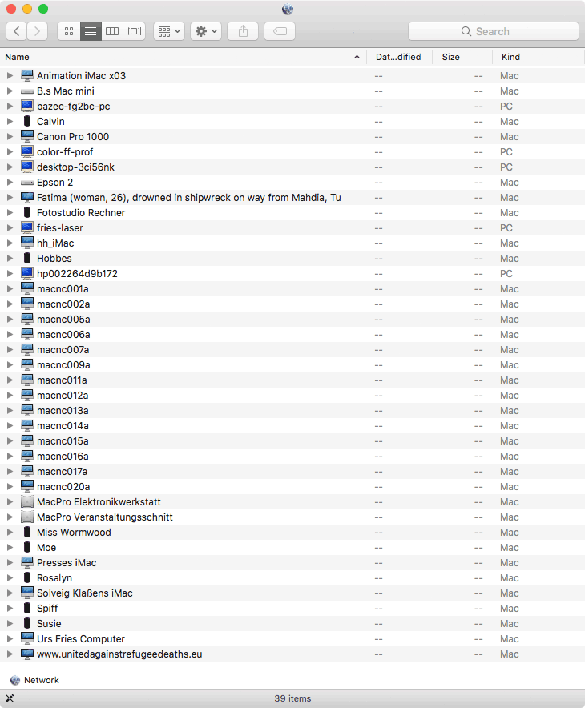
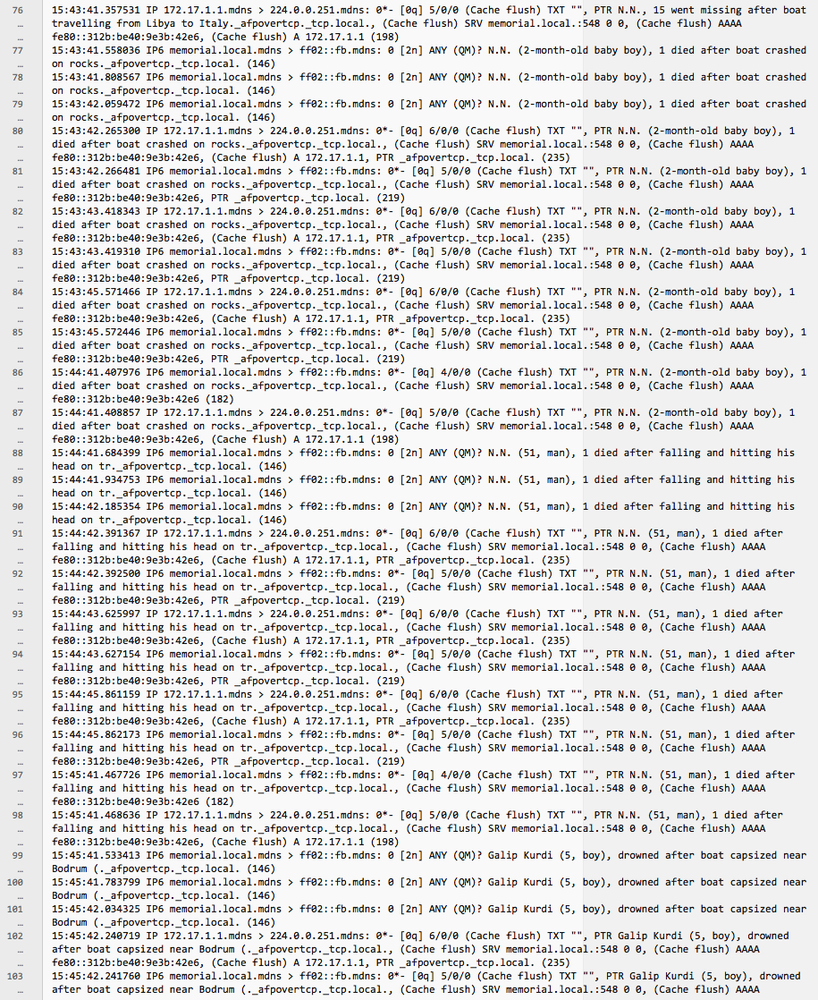

# memorial.sh
A network performance as live memorial to those who have died trying to make it into Europe.

The "network neighborhood", a functionality built in to all common desktop operating systems, shows you available local network resources. Often the computers are named after whoever uses them, so you can see who else is at work, even if it's physically remote from you, down the corridor or on another office floor.

The machines on the network become a kind of placeholder for the people that use them. They're present, and at the same time they're not. It's this 'place', both intimate and abstract, that the memorial populates with the people that have died trying to make it into Europe. As a small intervention and symbolic gesture, the memorial invites those that are not around anymore into these very specific "neighborhoods".

Even though it's not the only such trail in the world, the route into Europe is the most deadly. Because of the nature of the physical terrain, the exact number of incidents will remain forever unknown. The memorial is using the list of refugee deaths composed by the Dutch NGO UNITED for Intercultural Action, which seems to be the most reliable database. As of April 2019 it consists of 4333 documented incidents and 36.570 deaths. You can find out more about the list here: http://unitedagainstrefugeedeaths.eu. Contact: listofdeaths@unitedagainstracism.org.

## Implementation

Anyone can install and run the memorial. As a rule, the list of incidents should not be tampered with. Once started, the memorial should be allowed to display the list at least once in its entirety.

In an exhibition context the memorial should occupy the host institution's local network(s), and its presence should be made known to visitors. The Raspberry Pi should be placed in an accessible situation and a small screen attached, showing the script iterate through the line of incidents in real time.

## How it works

A simple shell script parses through the list of deaths and advertises each line as a hostname, using Avahi/Zeroconf (Bonjour on Mac OS). Every minute a new name is set. At this rate it'll take 72 hours to show the entire list of incidents. Due to technical limitations, only the first 63 characters of each line are shown.

## Technical requirements

Ideally run the script on a Raspberry Pi board, or any Linux machine, connected to local Ethernet and Wifi networks. To install, download the shell script and the list of incidents with `git clone https://github.com/christiansievers/memorial.sh`, and run it with i.e. `sudo bash memorial.sh &`
This won't persist after a reboot, so once confirmed that it works, [make it run as a system service](how_to_make_run_as_system_service.md), so it can perform continuously.

The easiest way to get it running is to use the fully configured [Raspberry Pi disk image](raspberry_pi_disk_image.md) - for those who don't have the time or the desire or the means to set things up themselves. 

## Contact

[Let me know](christiansievers.info/html/contact.html) if you'd like to have the memorial performed in your local network. I'd be happy to assist.

## Screenshots

an animation showing 24 random incidents, sped up 12x

hosts as the appear i.e. in Ubuntu

example network traffic, capture of two minutes

