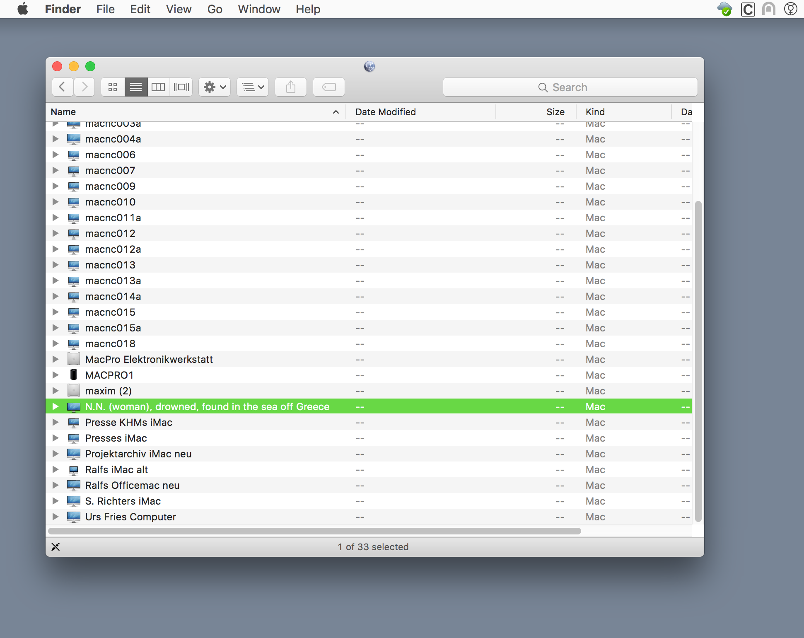

# memorial.sh
A network performance as live memorial to those who have died trying to make it into Europe.

The "network neighborhood", a functionality built in to all common operating systems, shows you available local network resources. Often the computers are named after whoever uses them, so you can see who is at work, even if it's physically remote from you.

The machines on the network become a kind of placeholder for the people that use them. They're present, and at the same time they're not. It's this 'place', both intimate and abstract, that the memorial populates with the people that have died trying to make it into Europe. As a small intervention and symbolic gesture, the memorial invites those that are not around anymore into these very specific "neighborhoods".

Even though it's not the only such trail in the world, the route into Europe is the most deadly. By its nature, the exact number of incidents will remain forever unknown. The memorial is using the list of refugee deaths composed by the Dutch NGO UNITED for Intercultural Action http://www.unitedagainstracism.org/, which seems to be the most reliable database. As of July 2017 it consists of 3545 documented incidents and 33.305 deaths.

## Implementation

Anyone can install and run the memorial. As a rule, the list of incidents should not be tampered with. Once started, the memorial should be allowed to display the list at least once in its entirety.

In an exhibition context the memorial should occupy the host institution's local network(s), and its presence should be made known to visitors.

## How it works

A simple shell script parses through the list of deaths and advertises each line as a hostname, using Avahi/Zeroconf (Bonjour on Apple's OS). Every minute a new name is set. At this rate it'll take 59 hours to show the entire list of incidents.

## Installation requirements

Raspberry Pi board or any Linux machine, connected to local Ethernet and Wifi networks. Download the shell script and the list of incidents, and run it with i.e. `sudo bash memorial.sh &`

## Screenshots

